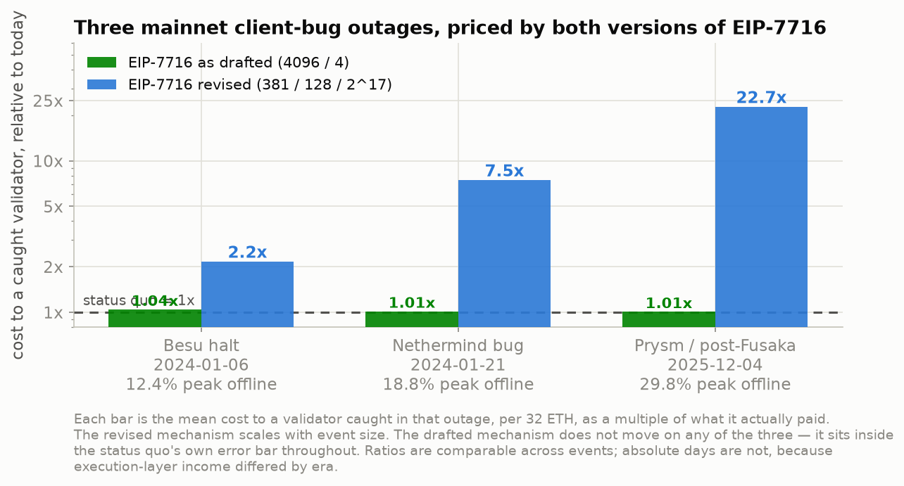

# EIP-7716 backtested against three mainnet outages

Start here. `README.md` covers the synthetic model; this covers the historical
backtest added on the `historical-backtest` branch.

---

## The result

Three real mainnet client-bug outages, spanning an order of magnitude in size,
scored under both versions of the mechanism.



| Event | peak offline | duration | peak factor | **as drafted** | **revised** |
|---|---|---|---|---|---|
| Besu halt, 2024-01-06 | 12.4% | 13.3 h | 46x | **1.04x** | **2.16x** |
| Nethermind bug, 2024-01-21 | 18.8% | 3.9 h | 71x | **1.01x** | **7.45x** |
| Prysm / post-Fusaka, 2025-12-04 | 29.8% | 4.5 h | 112x | **1.01x** | **22.74x** |

**The drafted mechanism is a no-op on all three.** 1.04x, 1.01x, 1.01x — inside
the status quo's own error bar every time, on the exact class of event it was
written for. That is the fixed-excess-penalty-budget invariant, measured on chain
data rather than argued from the algebra.

**The revised mechanism scales with severity.** 2.2x → 7.5x → 22.7x. It is
proportionate: a moderate incident draws a moderate multiplier. That is the
answer to "does this over-punish ordinary failures?"

The cap never binds on any of the three (peak offline 29.8% < 33%), so all three
sit in the band where the factor discriminates rather than saturating.

---

## Why you can trust the numbers

**Validated against your own spec, not a transcription.** `spec_check.py` fetches
`specs/_features/eip7716/beacon-chain.md` from
`OisinKyne/consensus-specs@eip7716-anti-correlation-penalties`, extracts the Python
blocks, executes them against real committee membership and effective balances,
and diffs the output against the pipeline. Non-zero exit on any disagreement.

All four checks exact on all three events:

| check | result |
|---|---|
| `get_slot_offline_balance` vs the SQL flag derivation | 0 gwei difference |
| `get_slot_penalty_factors` vs the pipeline recursion | exact |
| `process_smoothed_offline_balance` vs the carried EMA | exact |
| `get_attestation_participation_flag_indices` vs the flag rules | 0 / 28 mismatches |

**The reconstruction reproduces the published postmortem figures.** For the
December event: participation floor 74.726% against a published 74.7%,
missed-slot rate 18.45% against 18.5%, plateau offline share 22.56% against ~22.7%.

**The fork rule is handled.** EIP-7045 (Dencun) removed the inclusion-delay bound
on the timely-target flag, so the two January 2024 events are scored under the
Altair rule and validated against the Altair spec. Scoring them with the Deneb
rule would have understated the offline share and therefore the penalty.

---

## The gating question, answered per event

The mechanism only scales validators missing **both** timely source and timely
target. A validator with a timely source and a late target demonstrated liveness
and is exempt. So before any modelling: were the missing validators dark, or just
slow?

| Event | share of non-attesting stake that missed both flags |
|---|---|
| Besu | 85.1% |
| Nethermind | 91.8% |
| Prysm | 97.8% |

Dark in all three, decisively. Full breakdowns in `results*/step0_report.txt`.

---

## What this does not claim

**No behavioural response is modelled.** These are static counterfactuals: what
the mechanism would have charged given identical operator behaviour. They say
nothing about whether the outages would have happened under different incentives.

**No client attribution.** There is no on-chain fingerprint for execution clients,
and the ethPandaOps entity tables are ClickHouse-only. Events are named for their
published root cause, not for a measured client split. Any "client X was N% of the
validator set" figure in circulation is a self-reported survey.

**Absolute days are not comparable across events.** Days-to-recoup divides by
normal total staking income, and the execution-layer share was measured separately
per era (0.275 Besu, 0.255 Nethermind, 0.077 Prysm — MEV was far richer in early
2024). The vs-status-quo ratios are the honest cross-event comparison.

**Quote ranges.** Sensitivity across seeding window, EL share, and cohort
definition puts the December figure at 2.1–2.7 days, 20–25x.

**Nethermind has no behavioural attribution, deliberately.** The p2p sentry fleet
that would have answered "what were those validators doing" was itself knocked out
during that incident — recall fell to 7.95%, and all fifteen sentries across five
consensus clients degraded together at the onset epoch. `attribution.py` refuses to
emit a classification below a 95% recall floor rather than publishing a plausible
table built on 8% coverage. The EIP numbers above are unaffected: they come from
canonical chain data, not from sentries.

---

## Reproducing

```bash
python3 -m venv .venv && .venv/bin/pip install -r requirements.txt
./run_all.sh                          # the December event, from an empty data/
```

Any event in the registry:

```bash
.venv/bin/python xatu_ingest.py   --epoch-lo <lo> --epoch-hi <hi> --out-dir data/derived_<name>
.venv/bin/python eip7716_historical.py --derived-dir ... --event-lo ... --seed-lo ...
.venv/bin/python spec_check.py    --event <name> --epochs ... --seed-lo ... --seed-hi ...
.venv/bin/python results_table.py --event <name>
.venv/bin/python gen_figures_historical.py --event <name>
```

Events are defined once in `events.py` — epoch bounds, seed window, era-specific
economics, figure furniture. Adding a fourth outage is an entry in that file, not
an edit to seven modules.

Data: ethPandaOps Xatu public Parquet. No API key, no account, mainnet from
genesis. `data/` is gitignored and rebuilt by the ingest.

---

## Where things are

| | Besu | Nethermind | Prysm |
|---|---|---|---|
| numbers | `results_besu/RESULTS.md` | `results_nethermind/RESULTS.md` | `results/RESULTS.md` |
| gate | `results_besu/step0_report.txt` | `results_nethermind/step0_report.txt` | `results/step0_report.txt` |
| figures | `figures/besu1..5` | `figures/neth1..4` | `figures/h1..5` |

`figures/cmp1_ladder.png` is the cross-event chart above.
`FINDINGS.md` has the full method and caveat list for the December run.
