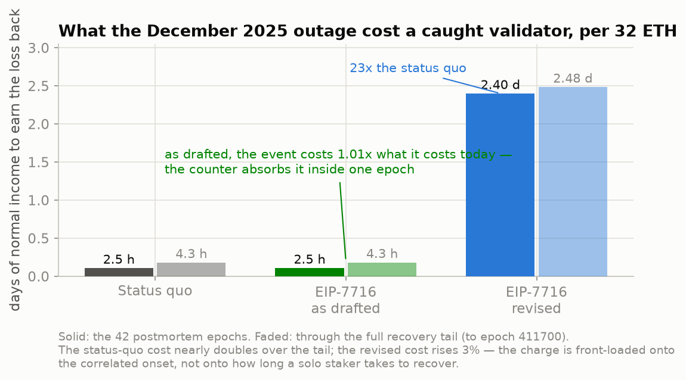
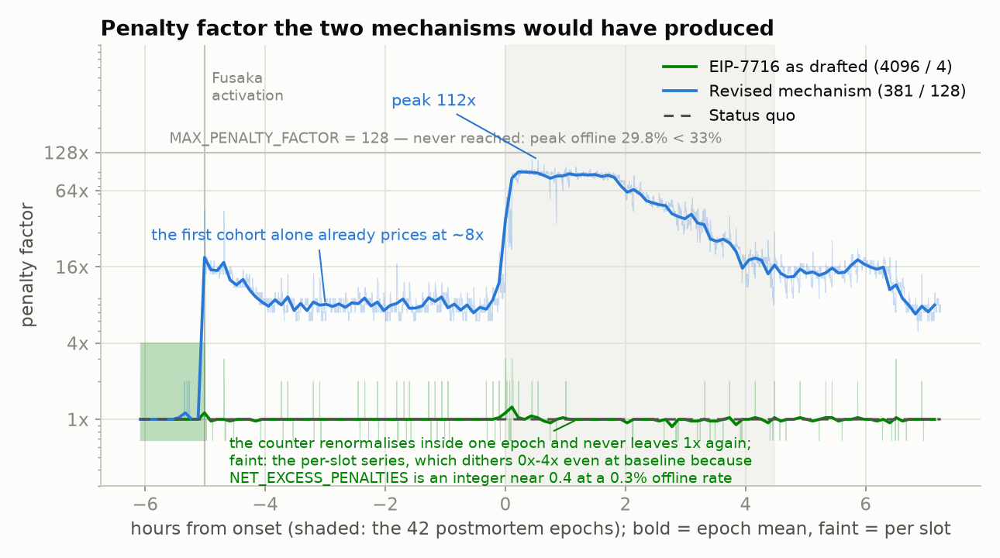
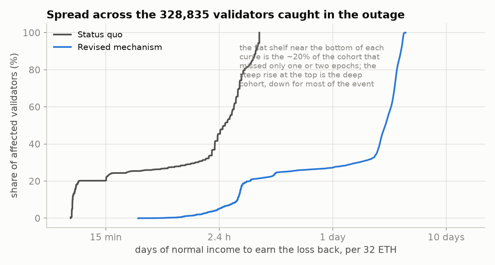
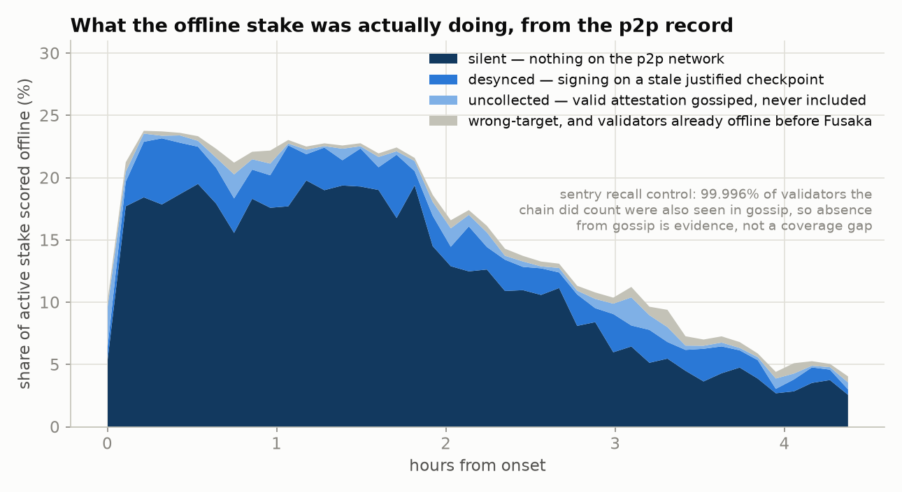

# The December 2025 post-Fusaka outage under EIP-7716

Historical backtest of the revised mechanism against real mainnet data, run on the
2025-12-04 correlated outage. Method, validation, and every caveat.

Reproduce with `./run_all.sh` (see [README](README.md#reproduce-the-historical-backtest)).
Numbers below are emitted by the code, not typed in; the tables live in
[`results/RESULTS.md`](results/RESULTS.md) and the raw values in
`results/summary.json` and `results/sensitivity.json`.

---

## Step 0 — the gating question, answered first

**Were those validators dark, or merely slow?**

EIP-7716 scales only the timely-target penalty, and only for validators missing
*both* the timely source and the timely target flag. A validator that lands a
timely source but a late or wrong target demonstrated liveness and pays today's
unscaled rate. Prysm's failure mode was attestation *resource exhaustion*, and an
exhausted node often still attests, just late — so if most of the missing stake
had produced timely sources, the factor would collapse toward 1x and there would
be no result here.

Over the 42 postmortem epochs (411439–411480), balance-weighted:

| | share of stake | share of validators |
|---|---|---|
| attested fully (timely source **and** target) | 84.338% | 83.724% |
| timely source, missed target — **not** scaled | 0.256% | 0.254% |
| missed source, timely target — **not** scaled | 0.208% | 0.201% |
| **missed both → offline, scaled** | **15.197%** | **15.821%** |
|  of which: no attestation included at all | 15.182% | 15.804% |
|  of which: attested late *and* wrong target | 0.016% | 0.018% |

The 15.2% is the mean across the whole window including the recovery ramp. At the
plateau — the 17 epochs above 20% offline — the offline share averages **22.56%**,
matching the postmortem's ~22.7%, and **97.75%** of the non-fully-attesting stake
missed both flags.

**They were dark.** Two independent controls:

- **Inclusion delay.** Of validators whose attestations *were* included during the
  event, 99.74% landed within the 5-slot timely-source window (baseline 99.93%);
  mean delay 1.275 slots against 1.054 before. There was no large late-but-alive
  population.
- **The p2p record.** Cross-referencing the 42 epochs against
  `beacon_api_eth_v1_events_attestation` (93 sentries, 483.7 M observations
  across epochs 411431-411487),
  **99.996%** of validators the chain *did* count were also seen gossiping — so
  absence from gossip is evidence, not a coverage gap. Only **21.6%** of the
  offline cohort was seen on the network at all. Four in five produced nothing
  anywhere.

The gating question passes. Everything below follows.

*A second, smaller cohort — around 2.5% of stake — went dark at Fusaka activation
and stayed off for the five hours before the main event. That is the second root
cause showing up in the participation record, separate from the 02:49 spike.*

---

## Method

### Data

ethPandaOps Xatu public Parquet at `data.ethpandaops.io`. No key, no account.

| table | use |
|---|---|
| `canonical_beacon_committee` | who was assigned to which slot |
| `canonical_beacon_elaborated_attestation` | what landed on chain, and when |
| `canonical_beacon_block` | the canonical chain, for target/head roots and missed slots |
| `canonical_beacon_validators` | effective balances, slashed flag, total active balance |
| `mev_relay_proposer_payload_delivered` | execution-layer proposer income |
| `beacon_api_eth_v1_events_attestation` | the p2p control and the attributed cut |

Pull range **411200–411700** (2025-12-03 01:20Z → 2025-12-05 06:46Z): a
pre-Fusaka baseline, the event, and the full recovery tail. beaconcha.in and
Rated were not used; neither was the "daily participation" chart, which is a
single-epoch snapshot taken around 00:29 UTC the following day and carries about
±3pp of noise.

### Deriving the participation flags

No public dataset stores participation flags. They are a SQL derivation from the
raw attestation records, following `get_attestation_participation_flag_indices`
in its post-EIP-7045 (Deneb) form:

- **matching source** is *guaranteed*, not derived. `process_attestation` asserts
  `is_matching_source`, so a block carrying a non-matching-source attestation is
  invalid and never becomes canonical. Confirmed empirically: exactly one distinct
  `source_root` per epoch across the whole pull range.
- **timely source** ⟸ `inclusion_delay <= integer_squareroot(32) = 5`
- **timely target** ⟸ `target_root == get_block_root(state, epoch)`, with no
  inclusion-delay bound (EIP-7045 removed it). `get_block_root` is reconstructed
  as the root of the most recent canonical block at or before `epoch * 32` — the
  skipped-slot fill-back `state.block_roots` performs.
- **timely head** ⟸ matching target, `beacon_block_root` equal to the canonical
  root at the attested slot, and `inclusion_delay == 1`.

A validator has one attestation duty per epoch, so multiple rows for the same
validator are the same attestation re-included across blocks or aggregates;
taking `bool_or` over them reproduces "the flag was set at some inclusion".

`is_offline_in_previous_epoch` is then `not slashed and not timely_source and not
timely_target`, and `get_slot_offline_balance` is the effective-balance sum over
each slot's committees.

### Running the mechanism

`get_slot_penalty_factors` walks the previous epoch's 32 slots updating a local
copy of the moving average, and `process_smoothed_offline_balance` then replays
the identical walk onto the state. The two collapse to a single chronological
per-slot recursion, which is what `revised_factors()` implements, in exact
integer arithmetic.

All three lines are driven by the **same** offline series, so the comparison
isolates the update rule rather than the trigger.

### Seeding the moving average

Seeded from epochs **411200–411391** — 192 epochs, ending at Fusaka activation.
Mean per-slot offline balance **3,519 ETH**, i.e. **0.316%** of stake. The
simulation then runs forward *through* the post-Fusaka period, so by the event
the moving average has already absorbed the 5-hour elevated shoulder and stands
at 3,812 ETH — the value the chain would actually have carried.

Seeding inside the Fusaka perturbation instead would treat that shoulder as
normal and understate the excess: doing so drops the headline from 2.40 to 2.12
days (see sensitivity).

### The days-to-recoup denominator

`days-to-recoup` divides by *normal total* staking income, which needs an
execution-layer assumption — the one input that cannot be read off the beacon
chain. Rather than assume it, it is measured: 21 days of
`mev_relay_proposer_payload_delivered` around the event give the amount actually
paid to proposers. Relay payments spread across every slot put EL at **7.4%** of
CL issuance; assuming locally-built blocks (9% of slots) earned the same per
block puts it at **8.1%**. The headline uses **7.7%**.

Measured CL APR 2.786%, total 2.99–3.01% — consistent with published figures for
the period, which is the cross-check that matters. This was a quiet MEV stretch;
the repo's July-2026 default of 21% is carried as a sensitivity row.

---

## Validation

### Against the executable spec

`spec_check.py` does not trust a transcription. It pulls the Python code blocks
out of `specs/_features/eip7716/beacon-chain.md` on the consensus-specs PR branch
and out of `specs/deneb/beacon-chain.md`, executes them against a minimal state
shim backed by the real committee membership, effective balances and derived
flags, and diffs their output against the pipeline:

| check | result |
|---|---|
| `get_slot_offline_balance` vs the SQL flag derivation, 4 epochs × 32 slots | exact match, 0 gwei |
| `get_slot_penalty_factors` vs `revised_factors()`, 4 epochs | exact match |
| `process_smoothed_offline_balance` vs the carried EMA | exact match |
| `get_attestation_participation_flag_indices` vs the SQL flag rules, 28 cases | 0 mismatches |

### Against the postmortem

| quantity | postmortem | reconstructed |
|---|---|---|
| participation floor | 74.7% | **74.726%** (epoch 411448) |
| share of the set offline | ~22.7% | **22.56%** (plateau mean), 23.79% peak epoch |
| missed-slot rate | 18.5% | **18.45%** (248 of 1344 slots) |
| forgone rewards, network-wide | ~382 ETH | **209 ETH** over the same 42 epochs, **349 ETH** through the pull range — see below |

Three of four match to within a rounding step. The fourth is a **window**
difference, not a reconstruction error. The 209 ETH is the incremental cost over
the 42 postmortem epochs only, against a pre-Fusaka baseline: 140.3 ETH forgone
attestation rewards, 47.7 ETH excess attestation penalties, 11.1 ETH forgone
proposer rewards on the consensus layer, 7.2 ETH on the execution layer, 2.4 ETH
sync committee. Extending the same accounting past the postmortem's cut-off:

| window | epochs | network cost |
|---|---|---|
| postmortem window | 411439–411480 | 209 ETH |
| + 2 hours of tail | 411439–411550 | 278 ETH |
| through the full pull range | 411439–411700 | **349 ETH** |

And the tail is still not closed at 411700: target participation is 98.80% there
against a 99.59% baseline. A window running a few hours further lands squarely on
~382 ETH. The published figure is best read as the cost of the whole episode
rather than of the 42 epochs the postmortem bounds — the two are simply different
quantities. (A higher MEV valuation than the 0.031 ETH per block actually paid
during that period would also close part of it.)

The same caveat applies to the "event plus recovery tail" row in the results: it
ends at 411700 while recovery was still in progress, so it is a lower bound.
Neither figure feeds the per-validator headline, which is computed from each
validator's own missed epochs.

Note that the dominant term is *not* the offline cohort's own loss (97.8 ETH). It
is the participation scaling every **online** validator absorbed: attestation
rewards carry a `participating_increments / active_increments` factor, so each
flag's reward is quadratic in that flag's participation rate. At 84% participation
the whole network earned less, not just the validators that were down.

---

## Results

Full tables in [`results/RESULTS.md`](results/RESULTS.md). The headline, per 32
ETH of stake, over the 42 postmortem epochs:

| Line | days-to-recoup | vs today |
|---|---|---|
| Status quo | **2.5 h** | 1.00x |
| EIP-7716 as drafted (PAF 4096, cap 4) | **2.5 h** | **1.01x** |
| EIP-7716 revised (slope 381, cap 128, 2¹⁷ EMA) | **2.40 d** | **22.7x** |

### The drafted mechanism does not price this event

Peak factor **3x**, mean over the 1344 event slots **1.000x**, 24 slots at a
factor of *zero*. The counter renormalises inside a single epoch and never leaves
1x again. A caught validator pays 1.01x what it pays today — for the largest
correlated outage since the Merge era, sitting in exactly the band the mechanism
was written to price.

This is the fixed-excess-penalty-budget invariant the revision was motivated by,
now demonstrated on real data rather than a synthetic scenario. It is not a
tuning failure: raising the cap redistributes the same budget.

A side observation, visible only on real data: at a 0.3% baseline offline rate,
`NET_EXCESS_PENALTIES` is an integer sitting near **0.4**. It therefore dithers
between 0 and 1 slot-to-slot, and the penalty factor dithers between 0x and 4x,
in completely normal operation. The mean is 1.0, so nothing is systematically
mispriced, but individual validators are getting a coin flip between a free miss
and a 4x one.

### The revised mechanism prices it, and the cap does not bind

Peak per-slot factor **112x** against a cap of 128, reached with 29.8% of stake
newly offline in a slot. The cap binds at one third by the slope identity, and
the event stayed below it — so the factor discriminated on event size rather than
pinning, which is the property the 22.7% event was chosen to test.

The factor an offline validator actually met, averaged over its own offline
epochs, was **68.9x**.

### Front-loading holds up

Extending from the 42 postmortem epochs to the full recovery tail (411700):

| Line | event only | + recovery tail | increase |
|---|---|---|---|
| Status quo | 2.5 h | 4.3 h | +70% |
| Revised | 2.40 d | 2.48 d | **+3%** |

Today's rules charge by the hour, so a slow-recovering solo staker pays 70% more
than one that recovered with the crowd. The revision charges for the correlated
onset and then goes quiet: the same slow staker pays 3% more. This is the
design's central claim about who bears the cost, and it survives contact with a
real recovery distribution.

### Re-arming

The moving average absorbed the event as designed but not instantly: 3,519 ETH
per slot at the seed, 3,812 at event onset, 5,487 by the end of the event, 6,389
by epoch 411700. The baseline the mechanism measures against roughly doubles,
from 0.32% to 0.57% of stake, and decays back with the 12.6-day half-life. A
second event in the following fortnight would have been priced against that
raised baseline.

---

## The attributed cut

**Client attribution: 100% `unknown`.** That is the finding, not a placeholder.

Consensus-client attribution requires proposal fingerprinting (blockprint), which
is not in the public Xatu Parquet mirror; the ethPandaOps CBT tables that carry
entity and client labels (`dim_node`, `fct_attestation_liveness_by_entity`,
`fct_block_proposer_entity`) are Clickhouse-only, confirmed by probing the public
paths. Execution-client attribution has no on-chain signal at all. Any
"Nethermind was N% of the validator set" figure is a self-reported survey;
multiplying the results above by one would give the survey's error bars the
appearance of chain data.

What the public record *does* support is a behavioural split, from the p2p
observations against the on-chain record. Balance-weighted over offline
validator-epochs:

| signature | % of offline stake | what it means |
|---|---|---|
| `silent` | 76.8% | nothing observable on the network |
| `desynced` | 15.2% | gossiped an attestation on a **stale justified checkpoint** |
| `uncollected` | 4.7% | correct source and target, gossiped, never included |
| `wrong-target` | 2.1% | correct source, non-canonical target |
| `chronic` | 1.2% | already offline through the pre-Fusaka baseline |

The `desynced` bucket is the sharpest forensic detail in the dataset. Those
attestations were **structurally unincludable**: `process_attestation` asserts
`is_matching_source`, so a block carrying them would have been invalid. Those
nodes were running, signing, and propagating — from a chain view that consensus
had left behind. That is precisely the shape a fake-invalid execution response
desyncing a consensus client would leave. Their propagation was also slow: the mean of each
validator's earliest sentry observation was 7.5 s into the slot, against 4.5 s
for validators that landed on chain.

It is *compatible with* the Nethermind → Nimbus path in the postmortem. It is not
proof of it. A node desynced by any cause looks the same.

Likewise, `silent` is what attestation resource exhaustion looks like from
outside — and also what an ordinary hard-down node of any client looks like.

Counting distinct validators rather than validator-epochs tells a different
story, and both are in [`results/RESULTS.md`](results/RESULTS.md) because the
difference is itself informative: 283,830 validators were `silent` at some point
and 199,294 were `desynced` at some point, out of 328,835 affected. Those
populations overlap heavily — nodes were flapping between the two, restarting,
resyncing, falling behind again. Assigning each validator its modal signature
therefore collapses `desynced` from 15.2% of offline stake to 4.4% of offline
validators, with a mean purity of only 0.61. Neither number is wrong; they answer
different questions, and quoting one without the other would misrepresent the
event.

---

## Uncertainty

| judgement call | headline | range | effect |
|---|---|---|---|
| seeding window | 2.40 d | 2.12 – 2.40 d | −12% at worst |
| EL share of income | 2.40 d | 2.13 – 2.41 d | −11% at worst |
| `uncollected` counted as online | 2.40 d | 2.40 – 2.67 d | **+11%** |
| drafted mechanism's scaling scope | 2.546 h | 2.541 – 2.546 h | negligible |

**Revised mechanism: 2.1 – 2.7 days-to-recoup per 32 ETH. Status quo: 2.3 – 2.8
hours. Ratio 20–25x.** Call it **~20x**, and note that the drafted mechanism sits
inside the status quo's own error bar.

Things that could still be wrong, in rough order of how much they would matter:

1. **The `uncollected` cohort.** 4.7% of offline stake produced a valid, correctly
   targeted attestation that the chain never counted. Under the spec as written
   they are offline and get scaled, so the model is faithful — but "offline" is
   arguably the wrong word for them, and if a future revision exempted them the
   plateau offline share drops from 22.6% to about 21.5%. Excluding them *raises* the
   headline (to 2.67 d) because they were mostly one- or two-epoch cases dragging
   the mean down.

2. **Attestation-inclusion capacity.** 8 of 1096 event blocks hit the Electra
   ceiling of 512 committee-rows, and 1.5% came within a dozen rows of it. Attestations
   remain includable for a full extra epoch and the average validators-included
   per block barely moved (36,653 during the event vs 36,358 before), so
   crowd-out is second-order — but it is not zero, and it works in the same
   direction as the `uncollected` caveat.

3. **Effective balances from snapshots.** `canonical_beacon_validators` is hourly
   and ~200 MB per file; six snapshots across the range are used, each epoch
   binding to the nearest. 43,483 of roughly 500 million validator-epoch
   assignments (**0.009%**) had no balance in their nearest snapshot and default
   to 32 ETH. Effective balance moves only at epoch boundaries and only through
   the Electra hysteresis band, so this is a sub-basis-point approximation.

4. **Sentry recall for the offline cohort.** Recall is measured at 99.996% for
   validators the chain counted, but that population is not identical to the
   offline one, and a validator gossiping only to a partitioned corner of the
   network could be missed. That would move stake from `silent` to `uncollected`
   or `desynced`, changing the attribution but not the headline.

5. **The 382 ETH discrepancy.** Unresolved, as set out above. It does not enter
   the per-validator result.

6. **`ChainContext` price.** ETH at $3,050 (CoinGecko, event window). Only affects
   USD conversions; days-to-recoup is price-independent.

---

## What is not here

- No other incidents. The catalog has 64; this covers one.
- No judgement on whether EIP-7716 is a good idea.
- No narrative copy.
- No parameter adjustment to make the result more compelling. The drafted
  mechanism's 1.01x is what it is.
