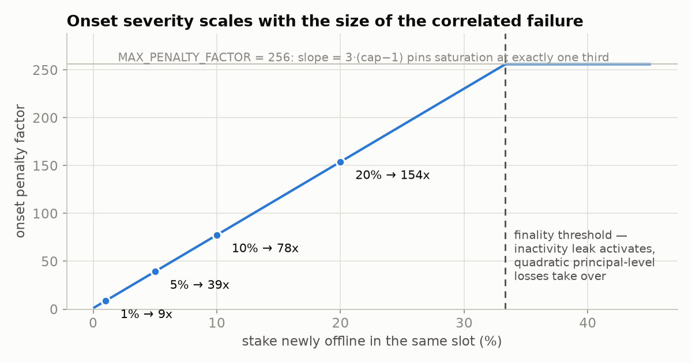
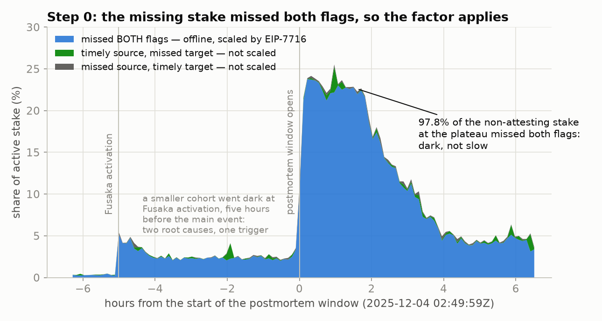
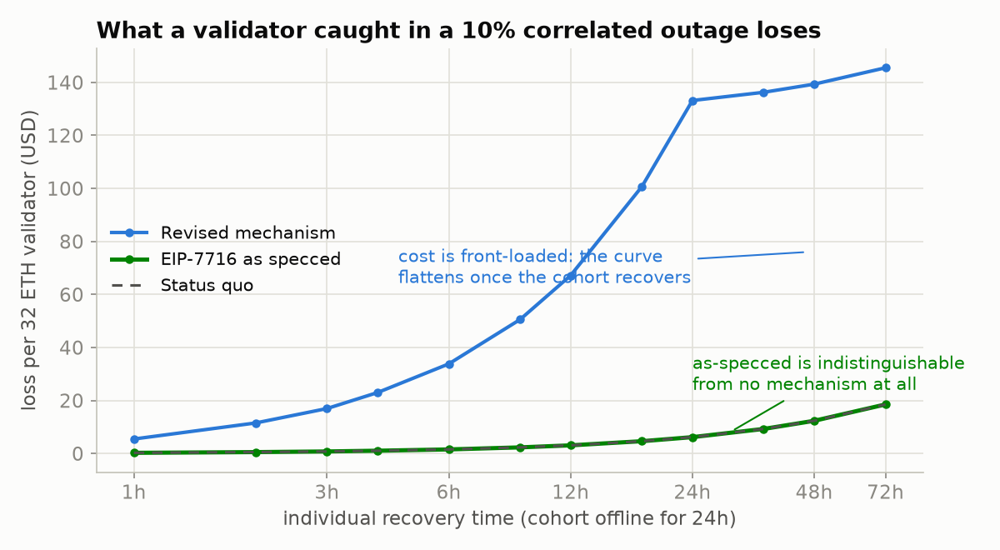

# EIP-7716: anti-correlation attestation penalties — model, calibration & figures

Supporting materials for the 2026 revival of [EIP-7716](https://eips.ethereum.org/EIPS/eip-7716) (anti-correlation attestation penalties): an exact-integer simulation of the originally drafted mechanism, the quantitative case for restructuring it, the calibration of the revised mechanism, and the figure-generation code for the accompanying write-up.

## The proposal, in one block

```
offline           = balance in a slot's committees missing BOTH
                    timely source AND timely target      # the "offline indicator"
committee_balance = total_active_balance // 32
factor            = min(1 + PENALTY_SLOPE * max(0, offline − smoothed_offline_balance)
                          // committee_balance,
                        MAX_PENALTY_FACTOR)    # cap 256, slope = 3·(cap−1) = 765
smoothed_offline_balance += (offline − smoothed_offline_balance)
                          // OFFLINE_BALANCE_SMOOTHING_FACTOR    # 2**17, ~12.6d half-life
```

The factor scales only the timely-**target** penalty of validators that produced no timely attestation at all. Uncorrelated failures pay exactly today's penalties; the factor is never below 1; the cap binds at exactly one third of stake — where the inactivity leak takes over — by the slope identity, at any baseline participation rate.



## Where the proposal lives

| Artifact | Link |
| --- | --- |
| EIP update PR (Stagnant → Draft, restructured mechanism) | [ethereum/EIPs#11962](https://github.com/ethereum/EIPs/pull/11962) |
| Executable consensus-specs feature (built on Heze) | [ethereum/consensus-specs#5452](https://github.com/ethereum/consensus-specs/pull/5452) |
| Analysis write-up (comment on the original thread) | [ethresear.ch/t/…/19116](https://ethresear.ch/t/supporting-decentralized-staking-through-more-anti-correlation-incentives/19116) — source in [`ethresearch-comment.md`](ethresearch-comment.md) |
| Hardfork tracking (PFI for Hegotá) | [forkcast.org/upgrade/hegota](https://forkcast.org/upgrade/hegota/#eip-7716) |
| EIP discussion thread | [ethereum-magicians.org/t/…/20137](https://ethereum-magicians.org/t/eip-7716-anti-correlation-attestation-penalties/20137) |

Prior work this builds on: Vitalik's [anti-correlation incentives analysis](https://ethresear.ch/t/supporting-decentralized-staking-through-more-anti-correlation-incentives/19116) and [concrete proposal](https://ethresear.ch/t/a-concrete-proposal-for-correlated-attester-penalties/19341), Toni's [backtest](https://ethresear.ch/t/analysis-on-correlated-attestation-penalties/19244), the [2024 explainer](https://ethresear.ch/t/diseconomies-of-scale-anti-correlation-penalties-eip-7716/20114), [FAQ](https://github.com/dapplion/anti-correlation-penalties-faq), and the [draft Lighthouse implementation](https://github.com/igorline/lighthouse/pull/1).

## Headline numbers

Per 32 eth validator, July 2026 parameters (~40.7M eth staked, eth ≈ $1,840, ~0.3% baseline offline rate — though the normalisation makes the results baseline-independent), cohort offline 24h:

| Event | Today | Revised | Payback |
| --- | --- | --- | --- |
| uncorrelated failure | $6.17 | $6.17 (1.0x) | 1.2 d |
| 10% correlated | $6.17 | $133 (21.6x) | ~3.7 wk |
| 20% correlated | $6.17 | $260 (42.2x) | ~7 wk |
| 40% down 3 days (finality lost) | $819 | $2,124 (2.6x) | ~14 mo ≈ 3.6% of principal |

In the 40% row the leak dominates the *today* column and remains unchanged: of the $2,124, $801 is the pre-existing inactivity leak and $1,324 is this proposal — the outsized total above one third comes mostly from mechanisms that already exist. At the operator scale the 10%/24h row is ~900 ETH per 1% of total stake run, on the order of 9,000 ETH for a 10%-of-stake operator whose fleet fails together for a day. Constants were chosen from a severity sweep over the real events below — caps 128–512 and slope-decoupled variants — documented in [`SEVERITY.md`](SEVERITY.md).

Under the *originally drafted* mechanism every one of these events costs within a few percent of $6.17, at any cap — the update rule has a fixed excess-penalty budget, `Σ(factor−1) = PAF·Δmiss/32`, independent of `MAX_PENALTY_FACTOR` and outage duration. That invariant is why the mechanism was restructured rather than retuned; see the write-up for the full argument.

## Backtest on real events

The numbers above are synthetic scenarios. There is now also a **historical path** that reconstructs the per-slot offline balances from real mainnet data and runs the same three parameter sets over every notable correlated outage of the Merge era. What a validator caught in each incident paid, as payback time — days of normal staking income needed to earn the loss back, per 32 ETH, each event under its own era's rules and measured EL income:

| Event | peak offline | payback today | as drafted (4096 / 4) | revised (765 / 256 / 2¹⁷) |
| --- | --- | --- | --- | --- |
| May 11+12 2023 finality incidents | 69% — cap binds | 46 min | 53 min (1.16x) | **1.9 days (79x)** |
| Besu halt, 2024-01-06 | 12.4% | 1.3 h | 1.3 h (1.04x) | **4.3 h (3.5x)** |
| Nethermind bug, 2024-01-21 | 18.8% | 1.5 h | 1.5 h (1.01x) | **21 h (14x)** |
| Prysm post-Fusaka, 2025-12-04 | 29.8% | 2.5 h | 2.5 h (1.01x) | **4.7 days (45x)** |

Two readings of that table. **The drafted mechanism is a measured no-op on all four events** — including May 2023, the incident that motivated it — which is the fixed-budget invariant on chain data rather than in algebra. **The revision scales with severity**: a moderate incident draws a moderate multiplier, the largest sub-finality event draws ~45x, and the cap binds only in the one event that crossed a third of stake. On the December 2025 event the peak factor is ~224x against the cap of 256 (peak per-slot offline stake 29.8%), the exposure is roughly 240 ETH per 1% of total stake run (~2,400 ETH for a 10%-of-stake operator), and extending to the full recovery tail raises the status-quo cost by 70% but the revised cost by ~3%: the charge lands on the correlated onset, not on how long a solo staker takes to come back.

Method, the flag derivation, spec validation, the attributed cut and every caveat are in [`FINDINGS.md`](FINDINGS.md); per-event tables in `results*/RESULTS.md` and the cross-event summary in [`BACKTEST.md`](BACKTEST.md). Those detailed tables were computed at the initial 381/128 calibration — exactly half of the adopted curve below the cap; the adopted-constants replays are in [`results_sweep/severity_sweep.json`](results_sweep/severity_sweep.json) and [`SEVERITY.md`](SEVERITY.md). Two follow-up analyses build on the same harness:

* [`WINDOW_TUNING.md`](WINDOW_TUNING.md) — the smoothing window and skew, swept over all four events with per-validator recovery hours measured from chain data. Headline: window length barely moves cliff events (it prices *sustained* outages), and a 24–36 h straggler pays 1.40x the 6–8 h crowd under this mechanism versus 4.1x under today's rules.
* [`REDISTRIBUTION.md`](REDISTRIBUTION.md) — why the extra penalties burn rather than redistribute: the original draft's issuance neutrality *is* the fixed-budget no-op, redistribution funds discouragement attacks (December 2025 would have created a ~4,600 ETH pot for online validators), and the worst-case burn is ~0.6% of one year's issuance, once.
* [`SEVERITY.md`](SEVERITY.md) — how the constants were chosen: caps 128–512 and slope-decoupled variants scored on the real events, bystander exposure, and worst-case bounds.



*The gating question first: EIP-7716 only scales validators missing **both** the timely source and timely target flags. 97.8% of the non-attesting stake at the plateau missed both — dark, not slow — so the factor applies.*



*The as-drafted mechanism (green) is indistinguishable from having no mechanism at all (grey, underneath it); the revision (blue) charges an amount operators will notice, front-loaded so that slow-recovering solo stakers aren't the ones who pay.*

## Files

### Synthetic model

| File | What it is |
| --- | --- |
| `eip7716_model.py` | Network anchors (stake, rewards, penalties) and an exact-integer simulation of the originally drafted `NET_EXCESS_PENALTIES` mechanism |
| `gen_figures.py` | The **final** revised mechanism (slope 381 / cap 128 / 2¹⁷ smoothing) plus the inactivity-leak model, and generation of figures `f1`–`f7` in `figures/` |
| `ethresearch-comment.md` | Source of the analysis write-up (image paths are local; swap for Discourse uploads) |
| `eip7716_variants.py` | *Design evolution:* cap/PAF sweeps proving the fixed-budget invariant, and an early slow-EMA-ratio design |
| `eip7716_frontloaded.py` | *Design evolution:* retuned-counter vs fast-EMA designs under heterogeneous recovery times, with the inactivity-leak model |
| `eip7716_aggressive.py` | *Design evolution:* EMA-relative excess-ratio calibration (superseded by the baseline-invariant absolute slope) |
| `eip7716_report.py` | *Design evolution:* early scenario tables |

The three *design evolution* scripts implement superseded parameterisations and are kept as the record of how the final design was reached (and why the alternatives — duration-punishing leaks, EMA-relative slopes, counter retuning, non-linear factors — were rejected). `gen_figures.py` is the source of truth for the proposed mechanism's behaviour.

### Historical backtest

| File | What it is |
| --- | --- |
| `xatu_ingest.py` | Historical ingestion path: Xatu public Parquet → participation flags → per-slot offline balances, the quantity `get_slot_offline_balance` returns |
| `eip7716_historical.py` | Runs status quo / drafted / revised over the real per-slot series; per-validator costs, days-to-recoup, network accounting, the attributed cut |
| `spec_check.py` | Executes the consensus-specs Python **directly out of the spec markdown** and diffs it against the pipeline |
| `attribution.py` | Behavioural split of the offline cohort from the p2p gossip record, with the sentry-recall control |
| `el_bonus.py` | Measures the execution-layer share of normal income from MEV relay payloads |
| `step0_report.py` | The gating question: the four-way flag breakdown and the dark-vs-slow controls |
| `sensitivity.py` | How the headline moves under each judgement call |
| `results_table.py` | Formats `results/summary.json` into `results/RESULTS.md` |
| `gen_figures_historical.py` | Figures `h1`–`h5`, same palette and styling as `gen_figures.py` |
| `run_all.sh` | The whole thing, from an empty `data/` |
| `events.py` | The event registry: epoch bounds, seed windows, era economics — one entry per catalogued outage |
| `FINDINGS.md` | Method, validation, results, caveats |
| `BACKTEST.md` | The cross-event summary: all four outages under both mechanisms |

### Window & skew sweep

| File | What it is |
| --- | --- |
| `window_sweep.py` | Replays each event under 12 update-rule variants (symmetric half-lives 2¹⁴–2¹⁸, asymmetric rise/fall skews); per-validator cost by measured recovery hour, quiet-window noise, synthetic sustained-outage and re-arm probes |
| `gen_sweep_report.py` | Formats `results_sweep/sweep_*.json` into [`results_sweep/SWEEP_REPORT.md`](results_sweep/SWEEP_REPORT.md) |
| `gen_sweep_figures.py` | Figures `w1`–`w3` |
| `smoke_test_sweep.py` | Schema-identical synthetic fixture that validates the sweep end-to-end without the ingest |
| `WINDOW_TUNING.md` | The analysis: what the window controls, the straggler question, why skew was rejected |
| `REDISTRIBUTION.md` | Burn vs redistribute, with the discouragement-attack and issuance-magnitude arguments |

## Reproduce

```bash
python3 -m venv .venv && .venv/bin/pip install -r requirements.txt
.venv/bin/python gen_figures.py     # regenerates figures/f*.png
.venv/bin/python eip7716_model.py   # original-mechanism scenario tables
```

Network parameters are embedded in `eip7716_model.Network` (defaults are the July 2026 snapshot); change them there to rerun the calibration under different assumptions of stake, price, or baseline offline rate.

### Reproduce the historical backtest

```bash
./run_all.sh          # ~5 GB of Parquet, ~10 min on a warm connection
```

Downloads about 5 GB of [ethPandaOps Xatu](https://ethpandaops.io/data/xatu/) public Parquet into `data/` (no key, no account, no rate limit), derives the participation flags, and writes `results/` and `figures/h*.png`. Re-runs against cached partitions take about three minutes. `data/` and the per-validator intermediates are gitignored; `results/*.{md,json,csv}` and the figures are tracked.

To run it on a different event, change the epoch range:

```bash
.venv/bin/python xatu_ingest.py --epoch-lo <lo> --epoch-hi <hi>
.venv/bin/python eip7716_historical.py --event-lo <lo> --event-hi <hi> --seed-lo <lo> --seed-hi <hi>
```
