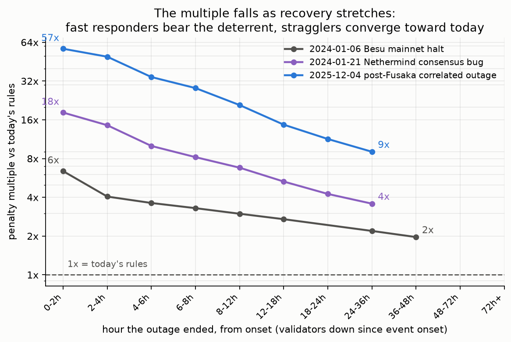

# Window length and skew, tested against five years of mainnet outages

Is `OFFLINE_BALANCE_SMOOTHING_FACTOR = 2^17` (12.6-day half-life) the right
smoothing window, and is there a skew of the update rule that keeps the
penalty meaningful for everyone caught in a correlated outage without
hammering operators who take 24 hours to apply an 8-hour patch?

> **Calibration note.** Sweep results, figures, and this document are at the
> adopted 765/256 constants ([`SEVERITY.md`](SEVERITY.md)); the detailed
> backtest record in `results*/` remains at the initial 381/128 (see
> [`BACKTEST.md`](BACKTEST.md)) — exactly half of the adopted curve below the
> cap.

Method: the historical backtest harness ([BACKTEST.md](BACKTEST.md)), extended
with [`window_sweep.py`](window_sweep.py), which replays every catalogued real
event under 12 update-rule variants — symmetric half-lives 2^14–2^18 (1.6–25.2
days) and asymmetric rise/fall splits down to a 1.2-hour rise — and, because
the ingest records every validator's offline epochs individually, computes
each validator's cost **as a function of its own measured recovery hour**. No
public postmortem documents per-operator recovery distributions; this measures
them from chain data. Full tables in
[`results_sweep/SWEEP_REPORT.md`](results_sweep/SWEEP_REPORT.md); reproduce
with `window_sweep.py --event <key>` after the ingest.

A fourth event joins the catalog for this analysis: the **May 11–12, 2023
finality incidents** (epochs 200551–554 and 200750–759, participation floors
~40% and 30.7% per the Prysm postmortem). It is the only recorded event that
binds the cap, the only one above the one-third saturation point, and — at 21
hours apart — the only real back-to-back test of re-arming. It is scored under
its era's own (pre-Deneb) target rule and its own measured economics: the EL
share of income over that window was **0.63 of CL** (the early-May 2023
memecoin MEV spike; measured from relay payloads by `el_bonus.py`, range
0.44–0.83).

## The event catalog

Event-window days-to-recoup per 32 ETH, each event under its era's measured
economics:

| Event | peak offline | cohort 50% / 90% recovered | patch available | revised | vs today |
|---|---|---|---|---|---|
| May 11+12 2023 finality incidents | 69% (cap-bound) | self-healed in ~26 / ~64 min | +31.5 h (after recovery) | 1.92 d | **79x** |
| Besu halt, 2024-01-06 | 12.4% | 13 h event + 48 h resync tail | +13 h | 4.3 h | **3.5x** |
| Nethermind bug, 2024-01-21 | 18.8% | fast (restart-only fix) | +3.9 h | 21 h | **14x** |
| Prysm post-Fusaka, 2025-12-04 | 29.8% | 50% at 2.8 h, 90% at 6.7 h | +1.8 h (runtime flag) | 4.73 d | **45x** |

The drafted (`NET_EXCESS_PENALTIES`) mechanism scores 1.16x on May 2023 — a
no-op on its own motivating incident, alongside the 1.04x / 1.01x / 1.01x
already measured on the other three. (Days above are event-window figures;
the sweep tables below use the event-plus-tail cohort, a slightly different
basis.)

Recovery in the wild is patch-gated in only half the catalog: May 2023
self-healed before any patch existed, and December 2025 recovered on a runtime
flag. Where a binary patch did gate recovery, the "8-hour patch, 24-hour
operator" spread is real — Besu's resync-required fix produced a 48-hour tail.

## What the window length controls, and what it doesn't

**Window length is nearly irrelevant to real events.** Every recorded outage
is a cliff: hours-scale, short against even the shortest candidate window.
Sweeping 2^14 → 2^18 moves the December 2025 event only 24.9x → 27.1x and May
2023 barely at all (56.1x → 56.6x); the straggler curves are
indistinguishable. During cap-bound
storms the cap sets severity and the window does nothing.

**The window prices exactly one thing: sustained outages.** A synthetic
10%-of-stake cohort holding down for 7 days costs 71 d (2^14) → 176 d (2^17) →
192 d (2^18) of income to recoup on the December-2025 baseline (≈158 d for
2^17 at the EIP's July-2026 anchors). That is the deterrent against a large
operator or region staying dark.

**Re-arm is a non-issue at these scales.** A repeat of December 2025 three
days later meets 0.99 of the original onset factor at 2^17; in the real May
2023 double event, incident B hit the cap under every variant tested.

**Quiet-window behaviour is benign.** At the 2025 noise floor ~10% of slots
tick a small factor (p99 = 3 — two or three extra 26/64-weight penalties on a
routine miss, cents); the occasional larger excursion in "quiet" windows is a
real micro-event being priced, not noise.

## The straggler question, answered from chain data

Tail-friendliness comes from the mechanism's structure, not the window: the
factor tracks *current excess* offline balance, so when the cohort recovers
the factor collapses and whoever is still down pays little. The figure and
table below hold the population fixed — **validators that went down at the
original onset and stayed down until they recovered**. Validators whose
outages began later (second waves, restart flapping) are excluded for
simplicity: their downtime landed after the factor had collapsed and is
priced near today's rates, so including them makes the curve dip in the
middle buckets for composition reasons rather than mechanism reasons.

On this fixed cohort the cost is monotone in recovery time, and the
interesting column is the *multiple over today's cost*, which **falls** as
recovery stretches — the penalty is front-loaded, so being down four times
longer costs far less than four times more relative to a fast responder
(December 2025, per 32 ETH):

| recovered by | n | today | revised (765/256) | multiple vs today |
|---|---|---|---|---|
| 0–2 h | 51,680 | 0.03 d | 1.57 d | **57x** |
| 6–8 h | 12,902 | 0.31 d | 8.67 d | 28x |
| 12–18 h | 2,622 | 0.74 d | 10.78 d | 15x |
| 24–36 h | 6,911 | 1.46 d | 13.15 d | **9x** |

A validator recovering at 24–36 h paid 1.5x one recovering at 6–8 h; today's
rules charge 4.7x for the same spread. The same falling-multiple shape holds
on every event with a recovery tail — a duration-proportional design would
plot as a flat line here:

Cross-event: Nethermind's onset cohort runs 18x → 4x over the same range, and
Besu's 36–48 h resync victims paid about twice today's cost for two extra
days of downtime.

May 2023 is the stress test for innocents — finality stalled, so healthy
validators' attestations couldn't land and were recorded offline. A bystander
swept in for 1–2 epochs paid 0.44 days of income (~$4.50 at the era price) at
the adopted constants; 90% of the missing stake at the plateau was dark by
every chain measure, and the both-flags gate exempted a further 5.3% of
live-but-slow stake. Under EIP-7045's full-epoch target window and Electra's
larger inclusion capacity the same storm would register fewer false-offline
validators, so that is an upper bound on today's equivalent.

## Skew variants: what they buy, what they surrender

A fast-rise / slow-fall split (the reference chases the spike upward with an
hours-scale half-life, releases at 12.6 d) is the only lever that materially
changes within-event fairness, and the improvement is modest — 1.5x → ~1.2x
straggler premium on the onset cohort — because cohort recovery already does
the work. The cost is
disqualifying:

- **Sustained deterrence collapses.** Under a 1.2-hour rise (`2^9`), a
  20%-of-stake operator can hold a 3-day outage at mean factor **2.7** —
  barely above today. Under the symmetric rule the same outage runs at mean
  factor ~71. Straggler forgiveness and sustained-outage forgiveness are the
  same physical quantity: a global factor cannot distinguish "still down
  because slow to patch" from "still down, period". The only separator is
  whether the cohort collapses, which is what the symmetric rule already keys
  on.
- **Ramp attacks don't beat it, but only trivially.** "Boil the frog"
  (ramp offline slowly so the fast reference tracks you, then hold) never
  costs less than the cliff (ramp/cliff total ≥ 1.0 on every variant) — but
  only because fast-rise variants price *every* sustained outage near 1x.
- **Re-arm blindness appears**: 0.84–0.94 of onset factor for a mid-size
  repeat within a week (the cap rescues large repeats).

## Conclusion

**Keep `OFFLINE_BALANCE_SMOOTHING_FACTOR = 2^17`, symmetric.** Anything in
2^16–2^18 is defensible for real events (they are indistinguishable there);
2^17 keeps the sustained-outage deterrent meaningful (~176 days of income for
a 10%-of-stake week), re-arms fully within days of cliff events, and is
exactly 16 sync-committee periods. Going shorter buys nothing on any recorded event
and halves the sustained deterrent; asymmetric skew improves the measured
straggler premium marginally while cutting sustained deterrence 4–10x and
adding a second constant to the spec.
